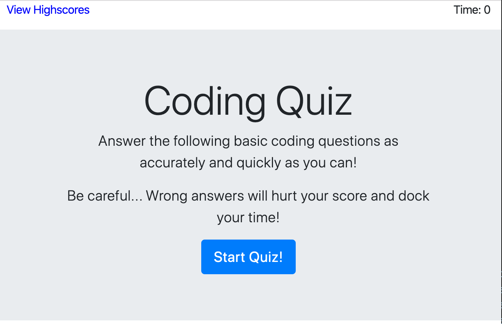
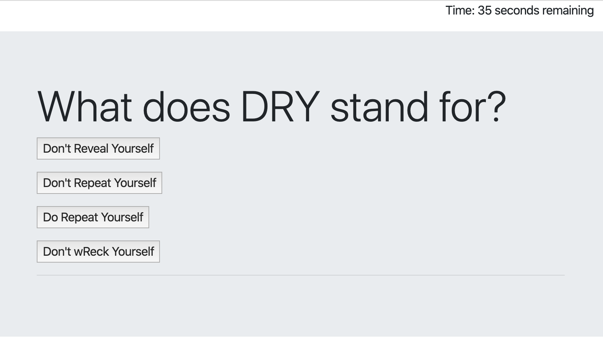
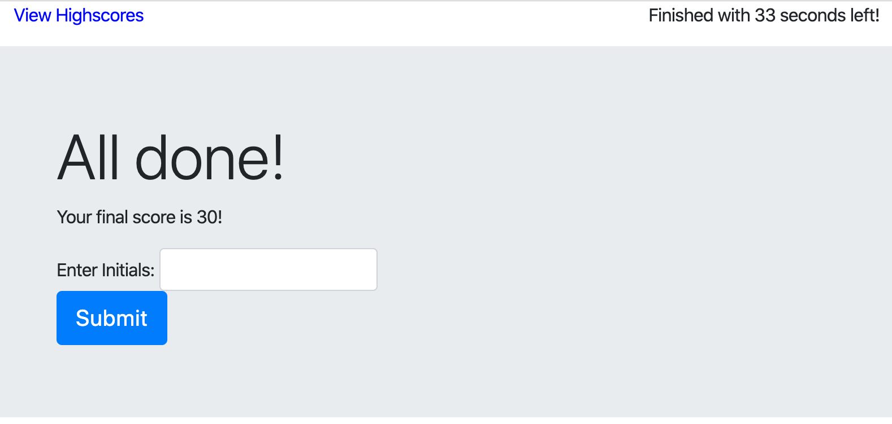
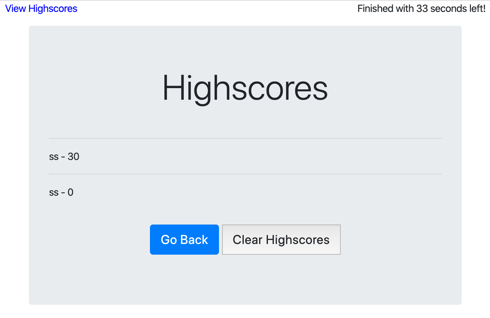

# codequiz

This is a timed 5-question quiz on JavaScript fundamentals that saves highscores in local storage and displays them as a list with user initials. If the user answers a question correctly, they receive 10 points. If they answer incorrectly, 10 seconds are subtracted from their timer.

Link to application:
[Code Quiz!](https://shanscirg.github.io/codequiz/)

Screenshots of application:

